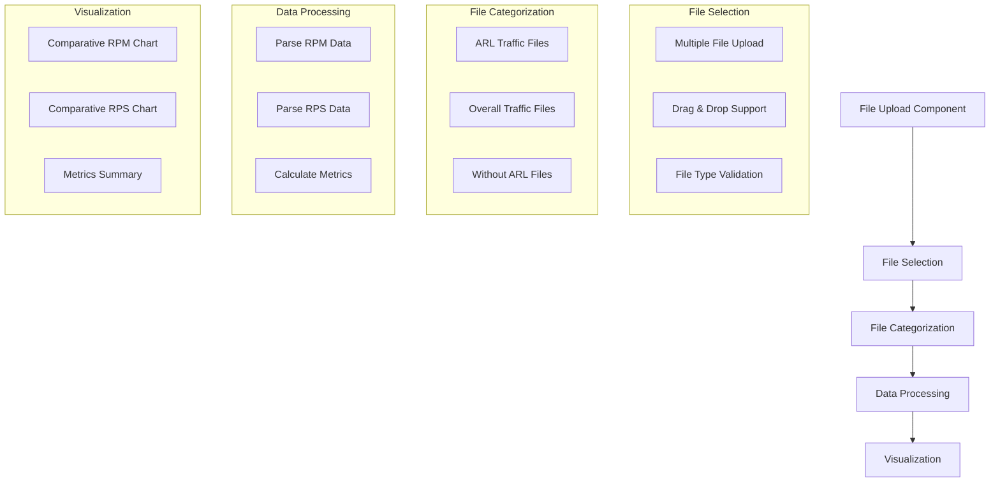

# Multi-File Traffic Analysis Enhancement Plan

## Overview
Enhance the Ghost Traffic Analysis feature to support uploading and analyzing multiple RPM/RPS file pairs simultaneously, providing comparative analysis across different traffic patterns.

## Current Implementation
- Single pair file upload (RPM + RPS)
- Basic traffic visualization
- Limited to one dataset at a time

## Proposed Changes

### 1. File Upload Enhancement
- New MultiFileUploader component supporting multiple file pairs
- Automatic file categorization based on prefixes:
  * ARL_RPM.txt & ARL_RPS.txt
  * Overall_RPM.txt & Overall_RPS.txt
  * Without_ARL_RPM.txt & Without_ARL_RPS.txt
- Validation for matching file pairs

### 2. Data Structure Updates
```typescript
interface TrafficData {
  arl: {
    rpm: RPMData[];
    rps: RPSData[];
  };
  overall: {
    rpm: RPMData[];
    rps: RPSData[];
  };
  withoutArl: {
    rpm: RPMData[];
    rps: RPSData[];
  };
}
```

### 3. Visualization Enhancements
- Comparative charts showing all datasets
- Dataset toggle controls
- Enhanced metrics summary with comparisons
- Color-coded visualization for different datasets

### 4. User Experience
- Visual feedback for file categorization
- Progress indicators
- Dataset selection controls

## Implementation Flow



## Benefits
1. Comprehensive traffic analysis
2. Easy comparison between different traffic patterns
3. Better understanding of ARL impact
4. Improved user experience with multiple file handling

## Technical Considerations
1. Performance optimization for multiple file processing
2. Memory management for larger datasets
3. Efficient data structure for comparative analysis
4. Responsive UI for multiple dataset visualization