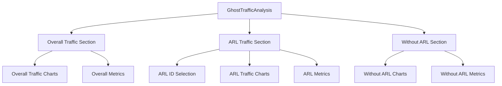

# Traffic Analysis Sections Enhancement

## Overview
Reorganize the Ghost Traffic Analysis into three distinct sections for better organization and clarity.

## Sections

### 1. Overall Traffic Pattern
- Display overall traffic metrics and trends
- Show RPM and RPS charts for total traffic
- Time range selection (5s, 10s, 15s, 30s, 1m, 10m, 30m, 1h, all)
- Maintain existing functionality for peak traffic analysis

### 2. ARL Level Traffic Pattern
- Keep existing ARL selection functionality
- Display selectable ARL IDs
- Show individual ARL traffic patterns
- Time range selection (5s, 10s, 15s, 30s, 1m, 10m, 30m, 1h, all)
- Display RPM and RPS charts for selected ARL

### 3. Traffic Pattern without ARLs
- Show traffic patterns excluding ARL traffic
- Display RPM and RPS charts
- Time range selection (5s, 10s, 15s, 30s, 1m, 10m, 30m, 1h, all)
- Include metrics specific to non-ARL traffic

## Component Structure

## Implementation Plan

1. Update GhostTrafficAnalysis:
   - Create tabbed or sectioned layout
   - Handle section navigation
   - Maintain state for active section

2. Modify MultiGhostTrafficAnalysis:
   - Focus on overall traffic visualization
   - Remove multi-dataset comparison
   - Add time range selection control
   - Enhance overall traffic metrics display

3. Keep ARLTrafficAnalysis:
   - Maintain existing functionality
   - Enhance ARL ID selection UI
   - Keep time range selection
   - Optimize time-based data filtering

4. Create WithoutARLTrafficAnalysis:
   - New component for non-ARL traffic
   - Include time range selection control
   - Similar structure to overall traffic
   - Specific metrics for non-ARL patterns

5. Data Management:
   - Update data hooks for section-specific needs
   - Ensure proper data separation between sections
   - Optimize data processing for each view

## Benefits
1. Clear separation of concerns
2. Better organization of traffic data
3. Improved user experience with focused sections
4. Easier navigation between different traffic views
5. More specific and relevant metrics per section