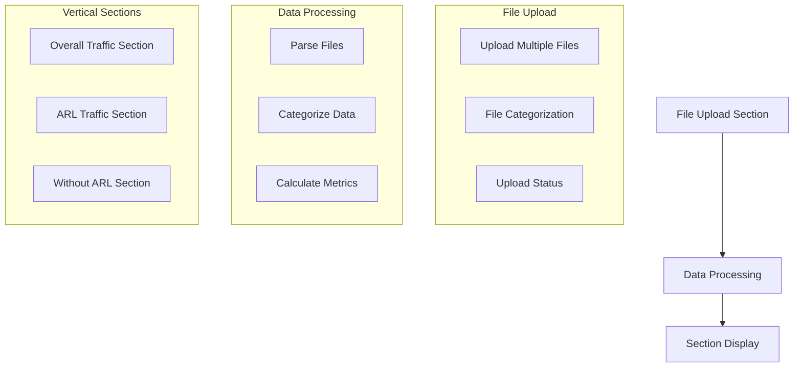

# Vertical Traffic Analysis Layout

## Overview
Reorganize the Ghost Traffic Analysis to show all sections vertically with a single file upload area at the top.

## Layout Structure



## Implementation Changes

1. File Upload Component:
   - Single MultiFileUploader at the top
   - Accept all RPM/RPS files at once
   - Auto-categorize files based on names:
     * Overall: Overall_RPM.txt, Overall_RPS.txt
     * ARL: ARL_RPM.txt, ARL_RPS.txt
     * Without ARL: Without_ARL_RPM.txt, Without_ARL_RPS.txt

2. Data Management:
   - Process all files simultaneously
   - Distribute data to appropriate sections
   - Calculate metrics for each category

3. Section Layout:
   - Stack sections vertically
   - Each section visible at all times
   - Consistent time range controls in each section
   - Maintain individual section functionality

## Component Structure

```typescript
interface FileCategories {
  overall: {
    rpm: File | null;
    rps: File | null;
  };
  arl: {
    rpm: File | null;
    rps: File | null;
  };
  withoutArl: {
    rpm: File | null;
    rps: File | null;
  };
}

interface ProcessedData {
  overall: TrafficData;
  arl: ARLTrafficData;
  withoutArl: TrafficData;
}
```

## Benefits
1. Better user experience with single upload
2. All data visible simultaneously
3. Easy comparison between sections
4. Clearer data relationships
5. No need to switch between tabs